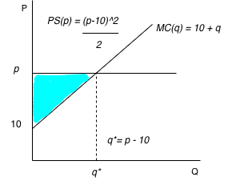

## 1. Consider a profit-maximizing firm with a marginal cost function given by MC(q) = 10 + q. It is a perfectly competitive firm i.e. it is a price-taker. The market price is p.

**a) Consider a situation where the firm is already in the market. What is the optimal quantity to produce? (Hint: the optimal quantity will be a function of p**

Given that $p = MC(q)$, we

$$p=10+q$$

$$q=p-10$$

But since $q^* \geq 0$, in our case, because $p \leq 10$, then the optimal quantity is:

$$q*=0$$

**b) Consider a situation where the firm is already in the market. Depict the marginal cost curve graphically, with the quantity produced on the x-axis and the prices/costs on the y-axis. Label the intercepts, as well as the optimal quantity. Label the producer surplus.**

\newpage

**c) Consider a situation where the the firm is deciding whether to enter the market or not. Suppose that the fixed cost is FC = 50. What is the price below which the firm will not enter the market.**

Considering our PS from before:

$$PS(p)=\frac{(p-10)^2}{2}$$

Then:

$$\pi(p)=\frac{(p-10)^2}{2}-50$$

Setting $\pi(p) = 0$, we have:
$$\frac{(p-10)^2}{2}-50=0$$
$$(p-10)^2=100$$
$$p-10=10$$
$$p=20$$

So the firm will not enter the market if the price is below $20$.

